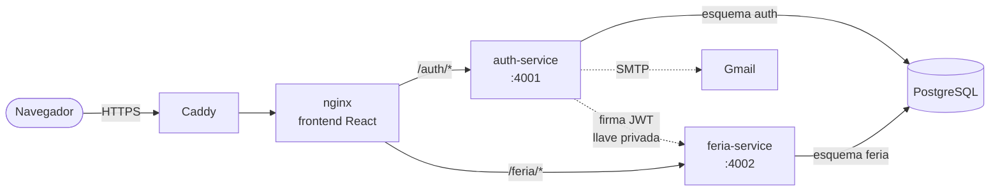

# Disagro · Feria de Promociones

Plataforma para que los clientes de Disagro **confirmen su asistencia** a la Feria de
Promociones anual y **elijan los servicios y productos de su interés**. Con esa selección
la plataforma calcula el descuento que obtienen y genera su **portafolio de promociones
personalizado**.

> **Demo:** desplegada en AWS EC2 con HTTPS; el enlace se comparte junto con la entrega.
> Para desplegar una instancia propia, ver la [guía de despliegue](docs/despliegue-ec2.md).

| | |
|---|---|
| **Stack** | Node.js · TypeScript · React · PostgreSQL |
| **Backend** | 2 microservicios Express con capas MVC y Prisma |
| **Frontend** | React 19 + Vite, sin librerías de UI |
| **Infraestructura** | Docker Compose · Caddy (HTTPS automático) · AWS EC2 |

---

## Funcionalidades

- **Cuenta de cliente:** registro, confirmación de correo (Gmail SMTP), inicio y cierre de sesión.
- **Manejo de sesión** *(el "Plus" de la prueba)*: access token JWT de 15 minutos y refresh
  token en cookie `httpOnly` que rota en cada uso; la sesión sobrevive a recargas de página.
- **Formulario de la feria** según el diseño propuesto:
  1. Datos del cliente (tomados de su cuenta), día y hora de visita dentro del horario del evento.
  2. Buscador con filtro *Todos / Servicios / Productos*, selección con casillas y
     **descuento calculado en vivo**, con sugerencias para alcanzar el siguiente.
- **Portafolio:** resumen con subtotales, descuentos y total; se puede imprimir.
- Se puede iniciar sesión sin haber confirmado el correo, pero **confirmar asistencia exige
  el correo verificado** (lo valida el backend).
- Interfaz con la paleta de Disagro, notificaciones de vidrio (*liquid glass*) y diseño adaptable a móvil.

### Reglas de descuento

| Tipo | Condición | Descuento |
|---|---|---|
| Servicios | 2 o más | **3%** |
| Servicios | 2 o más **y** suma **mayor a** Q.1,500 | **5%** |
| Productos | 3 o más | **3%** |
| Productos | 5 o más | **5%** |

El descuento se calcula en centavos (sin errores de punto flotante en el límite de
Q.1,500), lo valida el backend con los precios de la base de datos y queda **guardado** con
la confirmación. Detalle en [decisiones](docs/decisiones.md#5-reglas-de-descuento-en-código-y-guardadas-en-la-confirmación).

---

## Arquitectura



- El navegador ve **un solo origen**: el frontend y las APIs comparten dominio, sin CORS.
- **auth-service** emite los JWT con una llave privada RS256; **feria-service** los valida con
  la llave pública, sin consultar a auth-service en cada petición.
- Cada servicio es dueño de su propio esquema de PostgreSQL.

Más detalle en [docs/arquitectura.md](docs/arquitectura.md) y el modelo de datos en
[docs/modelo-datos.md](docs/modelo-datos.md).

---

## Levantar en local

**Requisitos:** Docker Desktop y Node.js 22 (solo para generar las llaves JWT).

```bash
# 1. Variables de entorno de cada servicio
cp services/auth-service/.env.example services/auth-service/.env
cp services/feria-service/.env.example services/feria-service/.env

# 2. Llaves JWT: pegue las dos líneas en services/auth-service/.env
#    y solo JWT_PUBLIC_KEY en services/feria-service/.env
node services/auth-service/scripts/generate-keys.mjs

# 3. Levantar todo (aplica migraciones y datos iniciales)
docker compose up -d --build
```

| Qué | Dirección |
|---|---|
| Plataforma | http://localhost:8080 |
| API de autenticación | http://localhost:8080/auth/docs |
| API de la feria | http://localhost:8080/feria/docs |

**Correo:** sin credenciales de Gmail el registro funciona igual y el enlace de verificación
aparece en el log (`docker compose logs auth-service`). Para enviar correos reales, defina
`GMAIL_USER` y `GMAIL_APP_PASSWORD` en `services/auth-service/.env` (ver `.env.example`).

**Base de datos desde cero:** `docker compose down -v && docker compose up -d`.

### Desarrollo del frontend con recarga en caliente

Con los servicios corriendo en Docker:

```bash
cd frontend && npm install && npm run dev   # http://localhost:5173
```

Vite reenvía `/auth` y `/feria` a los servicios, igual que nginx en producción.

---

## APIs

Documentación interactiva (OpenAPI 3.1 / Swagger) generada a partir de los mismos esquemas
Zod que validan las peticiones: `/auth/docs` y `/feria/docs`.

| Servicio | Método | Ruta | Acceso |
|---|---|---|---|
| auth | POST | `/auth/registro` | Público |
| auth | POST | `/auth/verificar` | Público |
| auth | POST | `/auth/reenviar-verificacion` | Público |
| auth | POST | `/auth/login` | Público |
| auth | POST | `/auth/refresh` | Cookie de sesión |
| auth | POST | `/auth/logout` | Cookie de sesión |
| auth | GET | `/auth/me` | JWT |
| feria | GET | `/feria/evento` | Público |
| feria | GET | `/feria/items` | Público |
| feria | GET | `/feria/confirmaciones/mia` | JWT · cliente |
| feria | POST | `/feria/confirmaciones` | JWT · cliente · correo verificado |

Todos los errores tienen el formato `{ "error": { "codigo", "mensaje", "detalles?" } }`; el
`codigo` es estable (p. ej. `EMAIL_NO_VERIFICADO`, `YA_CONFIRMADO`) para que el frontend
reaccione sin depender del texto.

---

## Estructura del repositorio

```
├── services/
│   ├── auth-service/        Registro, verificación de correo, login y sesión
│   │   ├── prisma/          Esquema y migraciones (esquema "auth")
│   │   └── src/
│   │       ├── routes/      URL y middlewares de cada endpoint
│   │       ├── controllers/ Leen la petición y responden (HTTP)
│   │       ├── services/    Reglas de negocio
│   │       ├── models/      Acceso a la base de datos (Prisma)
│   │       ├── dtos/        Validación de entrada (Zod)
│   │       ├── middlewares/ Autenticación, errores, límite de intentos
│   │       └── docs/        Especificación OpenAPI
│   └── feria-service/       Evento, catálogo y confirmaciones (misma estructura)
├── frontend/                React + Vite; nginx en producción
│   └── src/
│       ├── api/             Cliente HTTP, sesión y endpoints
│       ├── auth/            Contexto de sesión y rutas protegidas
│       ├── components/      Componentes reutilizables y de la feria
│       ├── pages/           Login, registro, verificación, inicio
│       └── utils/           Descuentos (copia de las reglas), formato, validación
├── deploy/                  Scripts y Caddyfile para la EC2
├── docs/                    Arquitectura, modelo de datos, decisiones, despliegue
├── docker-compose.yml           Configuración común
├── docker-compose.override.yml  Desarrollo (se carga solo)
└── docker-compose.prod.yml      Producción
```

---

## Pruebas

```bash
cd services/feria-service && npm test
```

18 pruebas unitarias de las reglas de descuento, incluidos los casos límite: un solo
servicio caro, servicios que suman exactamente Q.1,500, 4 y 5 productos, y sumas con
decimales cerca del umbral.

Cada servicio y el frontend se verifican además con `npm run typecheck`.

---

## Documentación

| Documento | Contenido |
|---|---|
| [Arquitectura](docs/arquitectura.md) | Componentes, capas, flujos de autenticación y confirmación, seguridad |
| [Modelo de datos](docs/modelo-datos.md) | Diagramas entidad-relación y justificación de cada tabla |
| [Decisiones de diseño](docs/decisiones.md) | Qué se eligió, por qué y qué alternativas se descartaron |
| [Despliegue en EC2](docs/despliegue-ec2.md) | Guía paso a paso en AWS con HTTPS |
