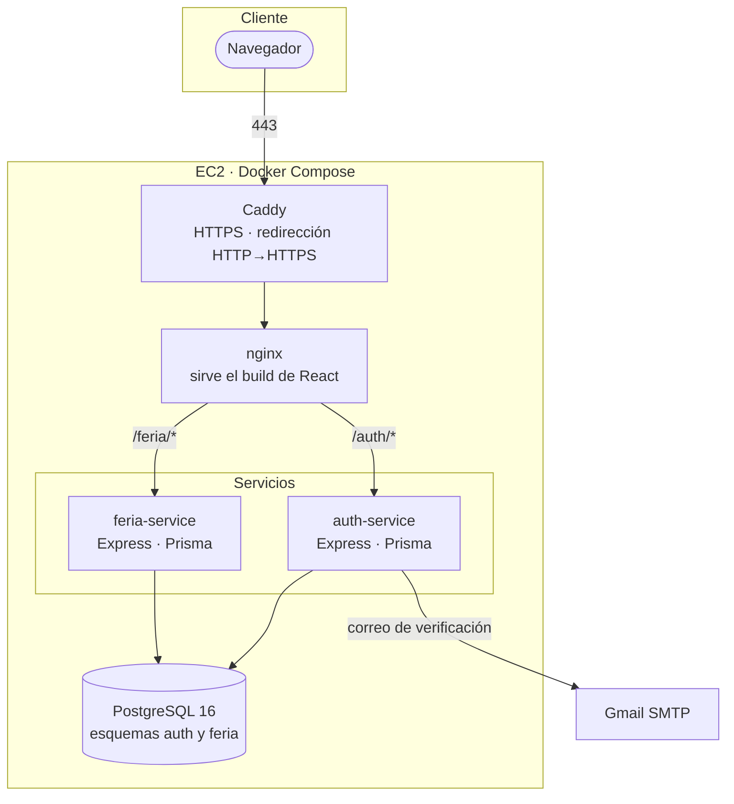
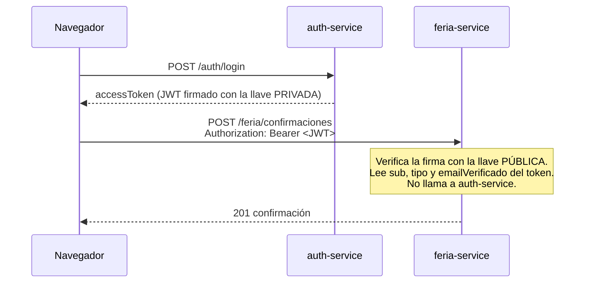
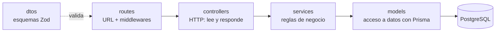
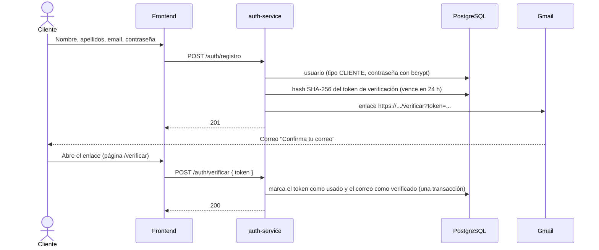
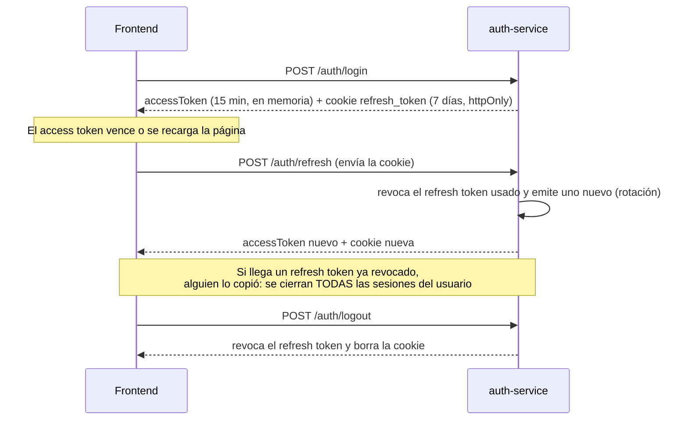
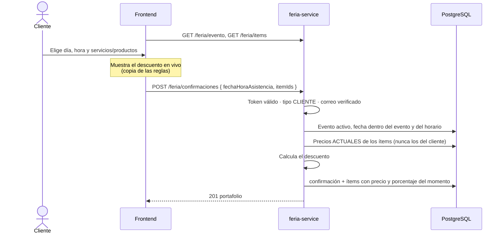

# Arquitectura

## Componentes

| Componente | Responsabilidad |
|---|---|
| **Caddy** | Única entrada pública. Obtiene y renueva el certificado HTTPS (Let's Encrypt), redirige HTTP a HTTPS, agrega cabeceras de seguridad. |
| **nginx** | Sirve la aplicación React (con *fallback* a `index.html` para las rutas del SPA) y reenvía `/auth` y `/feria` a cada servicio. |
| **auth-service** | Usuarios, tipos de usuario, verificación de correo, login, emisión y rotación de tokens. |
| **feria-service** | Evento activo, catálogo de servicios y productos, confirmaciones de asistencia y cálculo de descuentos. |
| **PostgreSQL** | Una base, un esquema por servicio (`auth`, `feria`). Ningún servicio lee el esquema del otro. |

### Un solo origen

El navegador habla siempre con el mismo dominio: `/` es el frontend, `/auth/*` y `/feria/*`
son las APIs. En desarrollo lo resuelve el proxy de Vite; en Docker, nginx; en una
arquitectura más grande lo haría un balanceador. Ventajas:

- No hay CORS que configurar.
- La cookie de sesión (`SameSite=Lax`, `path=/auth`) funciona sin ajustes especiales.
- El frontend usa rutas relativas (`fetch('/feria/items')`) y no necesita saber dónde vive cada API.

## Microservicios

Los servicios son independientes: cada uno tiene su `package.json`, su Dockerfile, sus
migraciones y su esquema de base de datos. Se comunican **solo a través del token**:

- **RS256 (llave pública/privada):** solo auth-service puede emitir tokens; cualquier otro
  servicio los valida con la llave pública, que no es secreta.
- `confirmacion.usuario_id` guarda el `sub` del token **sin llave foránea** hacia
  `auth.usuario`: cada servicio es dueño de sus datos y podría moverse a otra base sin
  cambios.

## Capas dentro de cada servicio (MVC)

En una API, la "vista" es la respuesta JSON; la interfaz visual la pone React.

| Capa | Sabe de | No sabe de |
|---|---|---|
| `routes` | URLs, orden de middlewares | Reglas de negocio |
| `controllers` | `req` / `res`, códigos HTTP | SQL |
| `services` | Reglas de negocio, `AppError` | HTTP, Express |
| `models` | Prisma, consultas | HTTP |

Los errores de negocio se lanzan como `AppError(status, codigo, mensaje)` y un único
middleware los convierte en `{ error: { codigo, mensaje, detalles } }`.

## Flujos principales

### Registro y verificación de correo

- En la base solo se guarda el **hash** del token: una copia de la base no permite verificar cuentas ajenas.
- El enlace abre una **página del frontend** que hace el `POST`. Si el enlace apuntara a un
  `GET` del backend, los antivirus y filtros de correo que abren enlaces para revisarlos
  consumirían el token antes que el cliente.
- Reenviar el correo invalida los enlaces anteriores.

### Sesión: login, refresh y logout

- El **access token vive solo en memoria** del navegador (no en `localStorage`): un script
  inyectado no puede leerlo. Al recargar, la sesión se recupera con la cookie.
- El frontend **comparte una sola petición de refresh** aunque varias partes la pidan a la
  vez (o React monte el componente dos veces): enviar dos veces el mismo token se
  detectaría como robo y cerraría la sesión.
- Ante un `401`, el frontend renueva la sesión y reintenta la petición una vez, sin que el usuario lo note.

### Confirmación de asistencia

## Seguridad

| Tema | Medida |
|---|---|
| Contraseñas | bcrypt con costo 12; mínimo 8 caracteres con letra y número |
| Tokens en base de datos | Solo hashes SHA-256 (verificación y refresh) |
| Enumeración de cuentas | Mismo mensaje y mismo tiempo de respuesta si el email no existe; reenviar verificación siempre responde 200 |
| Fuerza bruta | 20 intentos de login/registro cada 15 min por IP; 5 reenvíos de correo por hora |
| IP real tras proxies | `TRUST_PROXY_SALTOS` = 2 en producción (Caddy + nginx); un cliente no puede saltarse el límite falsificando `X-Forwarded-For` |
| Sesión | Cookie `httpOnly`, `Secure` (HTTPS), `SameSite=Lax`, limitada a `/auth`; rotación y detección de reutilización |
| Autorización | El tipo de usuario viaja en el token; el registro público solo crea `CLIENTE` (el tipo nunca se lee del cuerpo de la petición) |
| Datos del cliente | Precios y descuentos se recalculan en el servidor; el frontend solo los muestra |
| Entrada | Validación con Zod en cada endpoint; cuerpo JSON limitado a 10 KB |
| Cabeceras | Helmet en los servicios; HSTS, `nosniff` y `Referrer-Policy` en Caddy |
| Red | En producción solo Caddy publica puertos; la base de datos no es accesible desde Internet |
| Secretos | `.env` fuera del repositorio; en producción se generan en la instancia (llaves JWT propias, contraseña aleatoria de PostgreSQL) |
