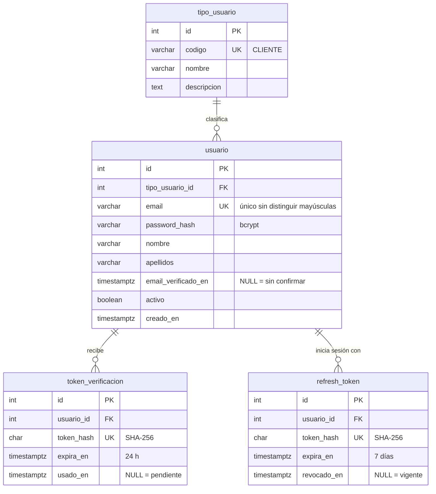
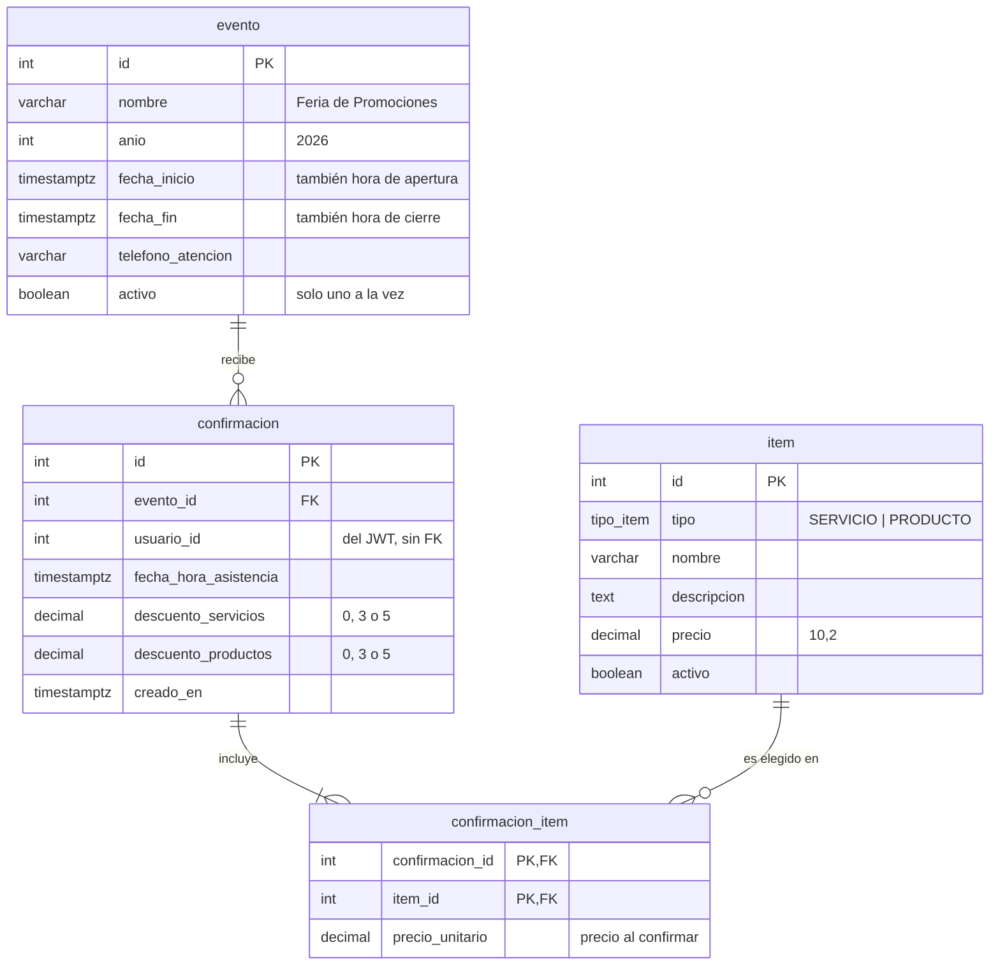

# Modelo de datos

Una base PostgreSQL con **un esquema por microservicio**. Cada servicio crea y modifica
sus tablas con sus propias migraciones de Prisma y no consulta el esquema del otro.

## Esquema `auth` (auth-service)

| Tabla | Por qué existe |
|---|---|
| `tipo_usuario` | Catálogo de tipos. Hoy solo `CLIENTE`, pero agregar `VENTAS` o `ADMIN` es un `INSERT`, no una migración. El código del tipo viaja en el JWT para autorizar en los demás servicios. |
| `usuario` | La cuenta del cliente. `email_verificado_en` guarda **cuándo** confirmó el correo, no solo un booleano. El índice único es sobre `lower(email)`. |
| `token_verificacion` | Enlaces de confirmación de correo. De un solo uso (`usado_en`), con vencimiento; al reenviar se invalidan los pendientes. |
| `refresh_token` | Sesiones abiertas. Se revocan al rotar o al cerrar sesión; un token revocado que vuelve a usarse cierra todas las sesiones del usuario. |

En las dos tablas de tokens solo se guarda el **hash**: el token real existe únicamente en
el correo o en la cookie del navegador.

## Esquema `feria` (feria-service)

| Tabla | Por qué existe |
|---|---|
| `evento` | Toda la configuración de la feria vive en datos: nombre, año, fechas, horario y teléfono que muestra el encabezado. Repetir la feria el año siguiente es insertar y activar un evento, sin desplegar código. Un índice único parcial garantiza un solo evento activo. |
| `item` | Servicios y productos en **una sola tabla** con un `tipo`: el buscador del formulario los muestra juntos. `activo` permite retirar un ítem sin borrar confirmaciones que lo incluyen. |
| `confirmacion` | La asistencia confirmada. `UNIQUE (evento_id, usuario_id)`: un cliente confirma una vez por evento. Guarda los **porcentajes otorgados**. |
| `confirmacion_item` | Los ítems elegidos con su **precio al momento de confirmar**. |

### Precios y descuentos guardados

`confirmacion_item.precio_unitario`, `descuento_servicios` y `descuento_productos` son una
**fotografía del momento de la confirmación**. Si después cambian los precios del catálogo
o las reglas de descuento, el portafolio sigue mostrando lo que el cliente vio y aceptó.
No son una factura: en la feria no hay compra; es el compromiso con el que ventas arma el
portafolio de cada cliente.

### `usuario_id` sin llave foránea

`confirmacion.usuario_id` viene del token ya validado (`sub` del JWT). No tiene llave
foránea hacia `auth.usuario` porque pertenece a otro servicio: mantener los esquemas
independientes permite separar las bases de datos más adelante sin tocar el código.

### Tipos de dato

| Dato | Tipo | Motivo |
|---|---|---|
| Montos | `DECIMAL(10,2)` | Sin errores de redondeo (nunca `float`) |
| Fechas | `TIMESTAMPTZ` | Con zona horaria; la interfaz las muestra en hora de Guatemala |
| Email | `VARCHAR` + índice único sobre `lower(email)` | `Ana@x.com` y `ana@x.com` son la misma cuenta |

## Datos iniciales

Las migraciones crean:

- el tipo de usuario `CLIENTE`;
- el evento **Feria de Promociones 2026**, del 16 al 20 de noviembre, de 08:00 a 17:00
  (hora de Guatemala);
- **7 servicios y 9 productos** con precios pensados para probar todos los descuentos
  (por ejemplo, dos servicios que suman más de Q.1,500).
